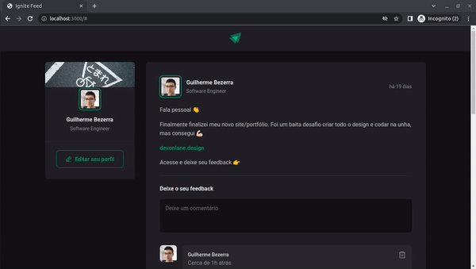

<p align="center">
    
    <h1 align="center">
    Ignite Feed
</h1>
</p>

<h4 align="center">
  Aplicação ReactJS + Typescript feita no Ignite pela Rockseseat no ano de 2022
</h4>

<p align="center">
  

  

  

  <a href="https://github.com/gbdsantos/reactjs-ignite-feed/commits/master">
    
  </a>

  <a href="https://github.com/gbdsantos/reactjs-ignite-feed/issues">
    
  </a>

  

  
</p>

<div align="center">
  <h4 align="center">Leia nos idiomas</h4>
  <a href="https://github.com/gbdsantos/reactjs-ignite-feed/"> :us:
  </a>
</div>


## :gear: Iniciando

```Bash
# Executar aplicação
npm run dev

# ou
yarn run dev
```

## :memo: Licença

Este projeto está sob a licença MIT. Veja em [LICENSE](https://github.com/gbdsantos/reactjs-ignite-feed/blob/master/LICENSE) para mais informações.

<br />

---
Feito ♥ por :man_astronaut: Guilherme Bezerra :wave: [Entrar em contato!](https://www.linkedin.com/in/gbdsantos/)
